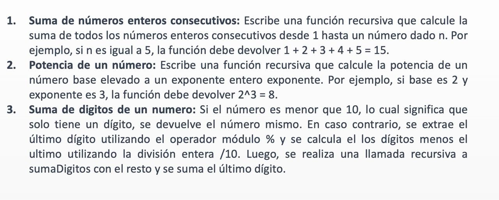

# Recursividad 
> [!TIP]
> Como Integracion por Partes

**Calculo:**  _Resolver hasta que me quede una integral directa_

**Programacion:** _Ejecutar hasta que el return sea directo 
                    (ya no pida el metodo)_
 

## "Pruebas de Escritorio"

---

### SumaEnterosConsecutivos

``` 
numero = 5
5 + {
    4 + {
        3 + {
            2 + {
                1 + {0}
            }
        } 
    } 
}

5 + { 4 + { 3 + { 2 + { 1 + {0} } } } }

= 15
```

### PotenciaDeNumero

```
base = 2
exponente = 3

2 * { // exponente = 2
        2 * {// exponente = 1
            2 * { // exponente = 0
                1
            }
        }
}

2 * { 2 * { 2* { 1 } } }

=8

```
### PotenciaDeNumero

```
numero = 2563 
// % saca el residuo... 256 / 10 = 25.6 ...  6

3 + { // 2563 % 10
    6 + { // 256 % 10 
        5 + { // 25 % 10
            { 2 }
        }
    }
}

3 + { 6 + { 5 + { 2 } }}

= 16
```


--- 

## Enuncuados



----

